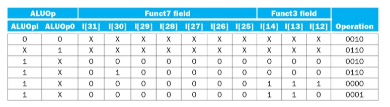

# Pipelined RISC-V Processor in iVerilog

## ALU

- INPUTS: `arg1`, `arg2`, `control_signal`

- OUTPUTS: `result`, `zero_flag`

## Register File

- We slice the 32-bit instruction into two, 5-bit data fields which are the register addresses.

- READ is always happening, WRITE only happens when `RegWrite` is 1. 

- Write data is a 64-bit line.

- INPUTS: `ReadReg1`,`ReadReg2`, `WriteReg`, `Write_data`, `RegWrite`

- OUTPUTS: `Read_data1`, `Read_data2`

- `Read_data1` is directly hard-wired to ALU Input 1.

- Hardcode 32 registers in an initial block.

- For `ReadReg1`,`ReadReg2` and `WriteReg`, we use a 5x32 decoder.

## Instruction Memory

This extracts 32-bits corresponding to the instruction indicated by the program counter (PC).

## Control Unit

- INPUTS: `opcode`

- OUTPUTS: `Branch`, `MemRead`, `MemtoReg`, `ALUOp`, `MemWrite`, `ALUSrc`, `RegWrite`

- This block reads the opcode and generates the control signals for the rest of the processor.

- `Branch` is set to 1 if the instruction is a branch instruction.

- `MemRead` is set to 1 if the instruction is a load instruction.

- `MemtoReg` is set to 1 if the instruction is a load instruction.

- `ALUOp` is set to 00 if the instruction is an R-type instruction, 01 if the instruction is an I-type instruction, 10 if the instruction is an S-type instruction, and 11 if the instruction is a branch instruction.

## Immediate Generation

- INPUTS: `instruction`

- OUTPUTS: 64-bit signed extended `immediate` value.

- This block reads the instruction and extracts the immediate value (sign-extended).

## ALU Control

- INPUTS: 2-bit `ALUOp`, `instruction [30,14-12]` 

- OUTPUTS: 4-bit `ALUControl`

- The reason why other instruction bits are not considered (in the input) is because they are pre-determined (see below).

## Data Memory

- INPUTS: `Address`, `Write_data`, `MemRead`, `MemWrite`

- OUTPUTS: `Read_data`