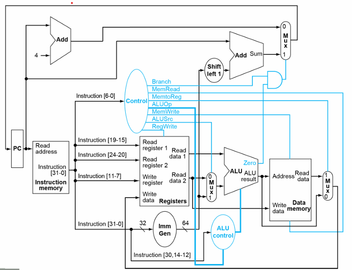

# Sequential RISC-V Processor in iVerilog

*One might think it's little endian or big endian, but in fact, it's* **PROUD INDIAN o7**

This is a basic RISC-V processor implemented in iVerilog, as part of the course project for the Spring 25' course "Intro. to Processor Architecture" at IIIT Hyderabad. The components in the sequential processor are mentioned below.

Team Name - Tervis Scoot

Team Members - Siddarth G, Varun S, M. Samartha

## PC

- INPUTS: `clk`,`reset`, `pc_in`
- OUTPUT: `pc_out`

The PC is a 64-bit register that stores the address of the current instruction. The PC is incremented by 4 (32-bit instructions) after every instruction, unless there is a branch, in which it is updated according to the branch target address. The PC is updated with the value of `pc_in` every clock cycle, so it does not need an exclusive write signal.

## Register File

- INPUTS: `clk`, `reset`, `read_reg1`, `read_reg2`, `write_reg`, `write_data`, `reg_write_en`

- OUTPUTS: `read_data1`, `read_data2`

- We slice the 32-bit instruction into two, 5-bit data fields which are the register addresses, which read the data from the register file, and output them as `read_data1` and `read_data2`.

- READ is always happening, WRITE only happens when `reg_write_en` is 1.

- `write_data` is a 64-bit line, for the data to be written into the register, given by line `write_reg`.

- `Read_data1` is directly hard-wired to ALU Input 1.

- Hardcode 32 registers in an initial block.

## Instruction Memory

- INPUTS: `clk`, `reset`, `addr`

- OUTPUTS: `instr`

This extracts 32-bits corresponding to the instruction indicated by the program counter (PC). Again, READ is always happening. Read happens from the text file containing the instructions. Instructions are constructed from memory in **Big Endian** format.

## Control Unit

- INPUTS: `opcode`

- OUTPUTS: `Branch`, `MemRead`, `MemtoReg`, `ALUOp`, `MemWrite`, `ALUSrc`, `RegWrite`

- This block reads the opcode and generates the control signals for the rest of the processor.

- `Branch` is set to 1 if the instruction is a branch instruction.

- `MemRead` is set to 1 if the instruction is a load instruction.

- `MemtoReg` is set to 1 if the instruction is a load instruction.

- `ALUOp` is set to 00 if the instruction is an R-type instruction, 01 if the instruction is an I-type instruction, 10 if the instruction is an S-type instruction, and 11 if the instruction is a branch instruction.

- `MemWrite` is set to 1 if the instruction is a store instruction.

- `ALUSrc` is set to 1 if the ALU second input is the value generated by the immediate block.

- `RegWrite` is set to 1 if the instruction is a load, or R-type instruction for write-back.

## Immediate Generation

- INPUTS: `instruction`

- OUTPUTS: 64-bit signed extended `immediate` value.

- This block reads the instruction and extracts the immediate value (sign-extended). The immediate value is then stored in a 64-bit bus, determined by the instruction type, referring the `RISC-V Card`.

## ALU Control

- INPUTS: 2-bit `ALUOp`, `instruction [30,14-12]`

- OUTPUTS: 4-bit `ALUControl`

- The reason why other instruction bits are not considered (in the input) is because they are pre-determined (see below).

- The ALUControl block reads the ALUOp and the instruction bits and generates the control signal for the ALU, to determine the operation to be performed.

## ALU

- INPUTS: `input1`, `input2`, `control_signal`

- OUTPUTS: `result`, `zero_flag`

The ALU takes the two inputs values and performs the operation according to the control signal provided by the ALU Control. The result is stored in `result` variable and if it is zero, the status for the same is stored in `zero_flag`.

## Data Memory

- INPUTS: `clk`, `reset`, `address`, `Write_data`, `MemRead`, `MemWrite`

- OUTPUTS: `read_data`

The data memory block reads the address and reads the data from the memory. If the instruction is a store instruction (`MemWrite` is asserted), the data is written to the memory. For a load, `MemRead` is asserted, and the data is read from the memory and output as `read_data`.

## MUXes

Apart from these main datapath units, we also have MUXes at three different locations in the datapath. 

1) **Second input to the ALU**, whether it comes from the immediate generation block or the register file. This is controlled by the `ALUSrc` signal.

2) **Input in WriteBack**, whether it comes from the ALU (R-type instruction) or the data memory (load instruction). This is controlled by the `MemtoReg` signal.

3) **Branch Target Address**, whether it comes from the immediate generation block or the PC + 4. This is controlled by the logical AND of the `Branch` signal, and the `z_flag` from the ALU.

## Adder Block

The adder blocks are instantiations of the carry look-ahead adder, which is used to calculate the branch target address, and for PC + 4.

# The Sequential Processor!

This gives us the final datapath for the sequential processor like in the figure at the top!

Instructions supported: addi, and, sub, add, or, ld, sd and beq.

# Testing Codes

The files `Name_exp.txt` contains the instruction with comments for understanding the code. The files `Name_Code.txt` contains the executable Byte addressed Hexadecimal Instructions. The code files are generated through the automated python script - `riscv_instruction_encoder.py` and the code file path is included in the `instruction_memory.v` for running that particular code.

1) `Test_Basic_exp.txt` contains instructions for checking arithmetic, logical, sd, ld, beq basic checking (18 instr) It also contains the edge case of writing onto register `x0`

2) `Test_Vector_Add.txt` contains instructions for checking vector addition (34 instructions)

3) `Test_Fibonacci_exp.txt` contains instructions for generating first 10 numbers of Fibonacci Series (28 instructions)

4) `Test_SumN_exp.txt` contains instructions for adding the first N Natural Numbers (9 instructions)

5) `Test_LinearSearch_exp.txt` contains instructions for Running a Linear search on an array and store the 0-based index (9 instructions)

6) `Test_FaultInstruction_exp.txt` contains instructions similar to `Test_Basic_exp.txt` but with a fault instruction (19 instructions). The output is unaffected by the fault instruction.

# Pipelined RISC-V Processor in iVerilog

A pipelined processor increases the throughput at the cost of latency, which is a good tradeoff. It is an extension of the sequential processor. We divide the sequenial processor into 5 stages namely the `Instruction Fetch`, `Instruction Decode`, `Execute`, `Memory`, `Write back`. We add register files with appropriate inputs and outputs in between these stages and connect them accordingly. The pipeline registers are added to store the intermediate values between the stages. The pipeline registers are synchronous and are updated at the rising edge of the clock (Except the ID/EX register file). Note that all the registers have a clock and reset as inputs, unless explicitly stated otherwise.

## IF/ID Register File

- INPUTS : 32-bit `instr`, 64-bit `pc_out`
- OUTPUTS : 32-bit `instr_IF_ID`, 64-bit `IF_ID_pc_out`

The instruction from the instruction memory and the pc value are stored in the IF/ID register file. The instruction is passed to the ID stage and the pc value is passed to the instruction memory to fetch the next instruction.

## ID/EX Register File

- INPUTS : 64-bit `IF_ID_pc_out`, 64-bit `read_data1`, 64-bit `read_data2`, 64-bit `imm`, 5-bit `rs1`, 5-bit `rs2`, 5-bit `rd`, 1-bit `reg_write_en_out_mux`, 1-bit `mem_read_out_mux`, 1-bit `mem_to_reg_out_mux`, 1-bit `mem_write_out_mux`, 1-bit `alu_src_out_mux`, 1-bit `reg_write_out_mux`, 4-bit `op_out_mux`, 1-bit `branch_out_mux`

- OUTPUTS : 64-bit `ID_EX_pc_out`, 64-bit `read_data1_ID_EX`, 64-bit `read_data2_ID_EX`, 64-bit `imm_ID_EX`, 5-bit `rs1_ID_EX`, 5-bit `rs2_ID_EX`, 5-bit `rd_ID_EX`, 1-bit `reg_write_en_ID_EX`, 1-bit `mem_read_ID_EX`, 1-bit `mem_to_reg_ID_EX`, 1-bit `mem_write_ID_EX`, 1-bit `alu_src_ID_EX`, 1-bit `reg_write_ID_EX`, 4-bit `op_ID_EX`, 1-bit `branch_ID_EX`

The ID/EX register file stores the values of the registers, immediate value, opcode, and control signals. The values are passed to the EX stage.

This register file reads on the NEGATIVE clock edge to ensure that a value that is written back is read in the same clock cycle.

## EX/MEM Register File

- INPUTS : 1-bit `mem_to_reg_ID_EX`, 1-bit `reg_write_en_ID_EX`, 1-bit `mem_read_ID_EX`, 1-bit `mem_write_ID_EX`, 1-bit `branch_ID_EX`, 64-bit `pc_next`, 1-bit `z_flag`, 64-bit `alu_out`, 64-bit `alu_in_2`, 5-bit `rs2_ID_EX`, 5-bit `rd_ID_EX`

- OUTPUTS : 1-bit `mem_to_reg_EX_MEM`, 1-bit `reg_write_en_EX_MEM`, 1-bit `mem_read_EX_MEM`, 1-bit `mem_write_EX_MEM`, 1-bit `branch_EX_MEM`, 64-bit `pc_next_EX_MEM`, 1-bit `z_flag_EX_MEM`, 64-bit `alu_out_EX_MEM`, 64-bit `data_EX_MEM`, 5-bit `rs2_EX_MEM`, 5-bit `rd_EX_MEM`

The EX/MEM register file stores the values of the ALU output, data to be written to the memory, and the control signals. The values are passed to the MEM stage. The pc_next value is passed to a mux which selects between the next instruction or the branch instruction at the PC register. The z_flag is passed to the branch unit to determine if the branch should be taken.

## MEM/WB Register File

- INPUTS : 1-bit `mem_to_reg_EX_MEM`, 1-bit `reg_write_en_EX_MEM`, 64-bit `data`, 64-bit `alu_out_EX_MEM`, 5-bit `rd_EX_MEM`

- OUTPUTS : 1-bit `mem_to_reg_MEM_WB`, 1-bit `reg_write_en_MEM_WB`, 64-bit `data_MEM_WB`, 64-bit `alu_out_MEM_WB`, 5-bit `rd_MEM_WB`

The MEM/WB register file stores the values of the ALU output and the data to be written back to the register file. The values are passed to the WB stage.

## Forwarding Unit

The forwarding unit is essential to handle control hazards. It checks for data hazards and forwards the data to the appropriate stage. The forwarding unit is implemented as a combinational circuit. The cases where we require forwarding are listed below.

1) Data that is used in an operation is being changed in the previous instruction. In this case, we have to forward the value from the EX/MEM register file to the EX stage.

e.g. `add x1, x2, x3` followed by `sub x4, x1, x5`

e.g. `add x1, x2, x3` followed by `beq x1, x4, 0x4`

e.g. `add x1, x2, x3` followed by `sd x1, 0(x4)`

e.g. `add x1, x2, x3` followed by `sd x4, 0(x1)`

e.g. `add x1, x2, x3` followed by `ld x4, 0(x1)`

2) Data that is used in an operation is being changed in the previous two instructions. In this case, we have to forward the value from the MEM/WB register file to the EX stage.

e.g. `add x1, x2, x3` followed by `add x4, x5, x6` followed by `sub x6, x1, x7`

In case of a DOUBLE DATA HAZARD, the priority is given to the EX/MEM register file.

3) We need forwarding from the MEM/WB stage to the MEM stage if we have a load instruction followed by a store instruction.

e.g. `ld x1, 0(x2)` followed by `sd x1, 0(x3)`

e.g. `ld x1, 0(x2)` followed by `sd x4, 0(x1)`

However, there are few cases where we need to stall the pipeline as well along with forwarding. They are

1) Load-Use Hazard : When a load instruction is followed by an instruction that uses the loaded value, we need to stall the pipeline by inserting a bubble in the pipeline.

e.g. `ld x1, 0(x2)` followed by `add x3, x1, x4`

e.g. `ld x1, 0(x2)` followed by `beq x1, x3, 0x4`

e.g. `ld x1, 0(x2)` followed by `ld x3, 0(x1)`

- INPUTS : 5-bit `ID_EX_rs1`, 5-bit `ID_EX_rs2`, 5-bit `EX_MEM_rd`, 1-bit `EX_MEM_reg_write_en`, 5-bit `MEM_WB_rd`, 1-bit `MEM_WB_reg_write_en`

- OUTPUTS : 2-bit `ForwardA`, 2-bit `ForwardB`

The inputs to the ALU are selected by the forwarding unit. The load store data hazard is handled by another forwarding unit.

- INPUTS : 5-bit `ld_rd`, 64-bit `sd_rs2_data`, 1-bit `ld_sd_mem_to_reg`, 1-bit `ld_sd_mem_write`

- OUTPUTS : 1-bit `ld_sd_sel`

The select line is for a mux that selects between the data from the MEM/WB register file and the data from the data memory. The data memory is read in the MEM stage. 

## Hazard Detection Unit

The hazard detection unit is essential to handle control hazards. It checks for control hazards and stalls/flushes the pipeline if required. 

The cases where a stall is required is often with forwarding. They are listed in the forwarding sesction. We will discuss the case of a flush here. If the prediction turns out to be wrong, i.e., the branch is taken, we have to flush the pipeline. In this case, we have to reset the pc value to the branch target address and insert bubbles in the pipeline. This is done by flushing the IF/ID and ID/EX register files since they will already have two wrong instructions.

- INPUTS : 5-bit `IF_ID_rs1`, 5-bit `IF_ID_rs2`, 5-bit `ID_EX_rd`, 1-bit `ID_EX_mem_read`, 1-bit `ld_sd_mem_write`, 1-bit `ld_sd_mem_read`

- OUTPUTS : 1-bit `pc_write`, 1-bit `IF_ID_write`, 1-bit `control_mux_sel`

# The Pipelined Processor!

After integrating the blocks with the pipeline registers, we get the final pipelined processor as shown in the figure here!

Instructions supported: addi, and, sub, add, or, ld, sd and beq.

# Testing Codes

The files `Name_exp.txt` contains the instruction with comments for understanding the code. The files `Name_Code.txt` contains the executable Byte addressed Hexadecimal Instructions. The code files are generated through the automated python script - `riscv_instruction_encoder.py` and the code file path is included in the `instruction_memory.v` for running that particular code.

# Idhar se test cases ka description likhna hai smh

1) `Test_Basic_exp.txt` contains instructions for checking arithmetic, logical, sd, ld, beq basic checking (18 instr) It also contains the edge case of writing onto register `x0`

2) `Test_Vector_Add.txt` contains instructions for checking vector addition (34 instructions)

3) `Test_Fibonacci_exp.txt` contains instructions for generating first 10 numbers of Fibonacci Series (28 instructions)

4) `Test_SumN_exp.txt` contains instructions for adding the first N Natural Numbers (9 instructions)

5) `Test_LinearSearch_exp.txt` contains instructions for Running a Linear search on an array and store the 0-based index (9 instructions)

6) `Test_FaultInstruction_exp.txt` contains instructions similar to `Test_Basic_exp.txt` but with a fault instruction (19 instructions). The output is unaffected by the fault instruction.